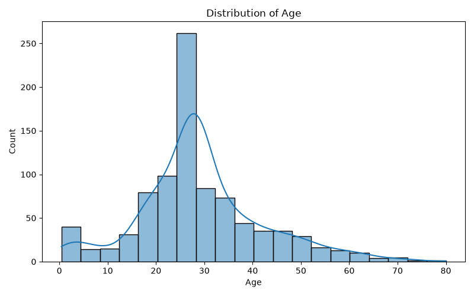
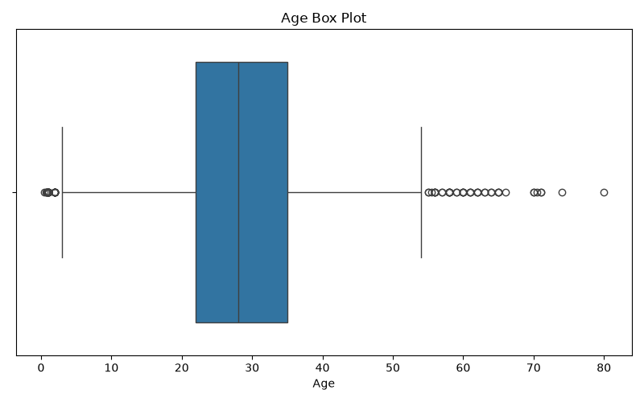
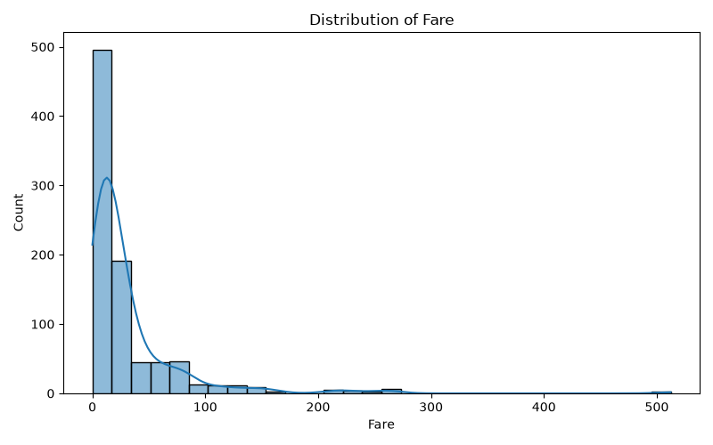
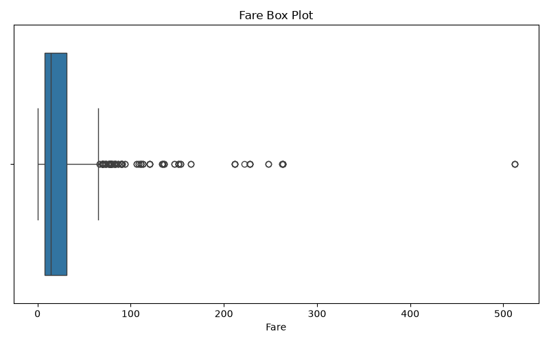
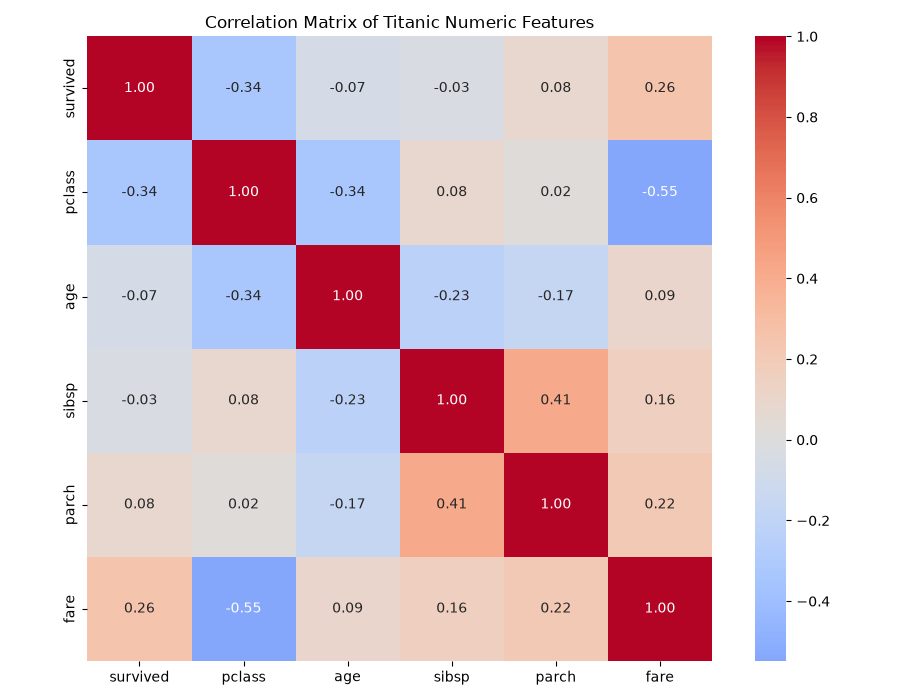
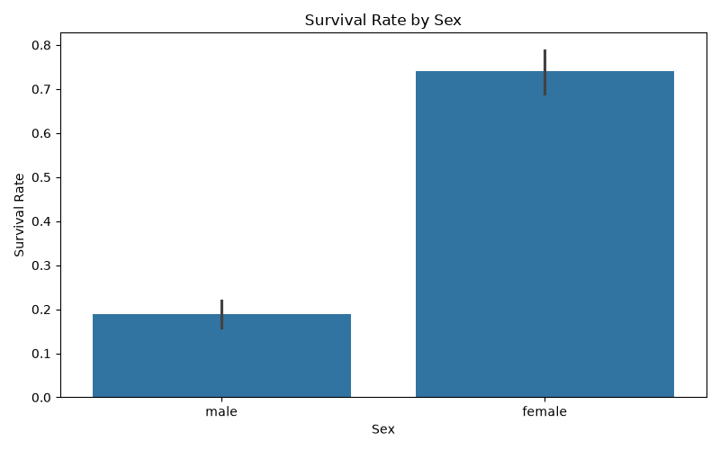
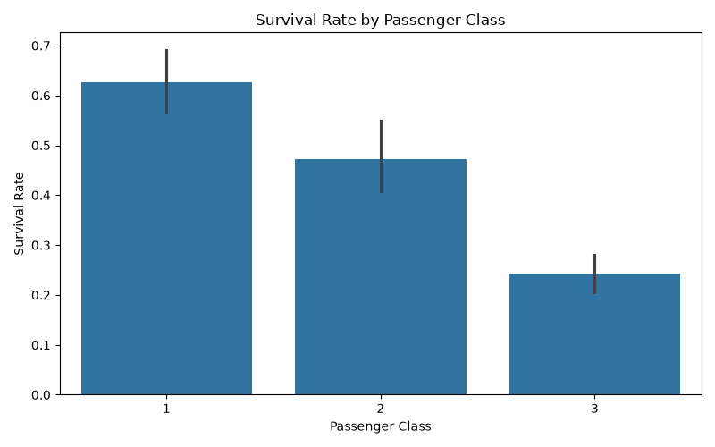
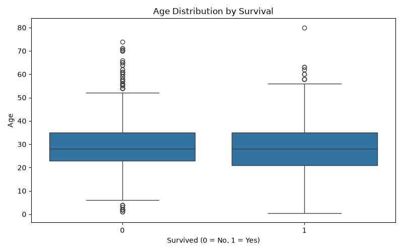
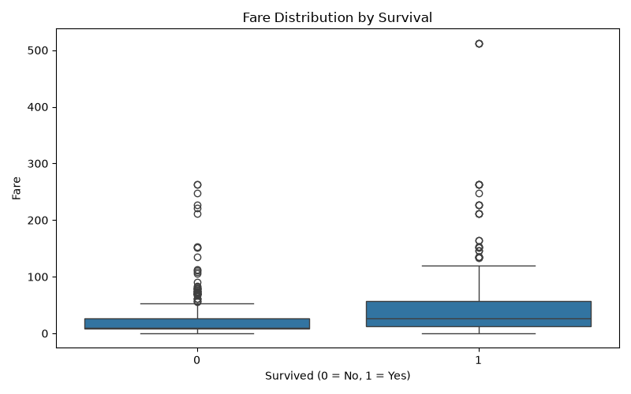

# Titanic EDA Report

## 1. Dataset Profile

- Rows: **889**
- Columns: **14**

### Missing Values

- **deck**: 77.22% missing
- **age**: 19.87% missing
- **embarked**: 0.22% missing
- **embark_town**: 0.22% missing

## 2. Missing-Value Handling

- deck: 77.22% missing -> COLUMN DROPPED because missingness is too high for reliable imputation.
- age: 19.87% missing -> IMPUTED using median (28.00).
- embarked: 0.22% missing -> DROPPED rows containing missing values.
- embark_town: 0.22% missing -> DROPPED rows containing missing values.

Columns with less than 5% missing values had the affected rows removed. Columns with 5%–30% missing values were imputed. Columns with more than 30% missing values were dropped because imputation would be unreliable given the high proportion of missing observations.

## 3. Univariate Analysis

- Age IQR outliers: **65**
- Fare IQR outliers: **114**

- Fare mean: **32.10**
- Fare median: **14.45**
- Fare mode: **8.05**

Fare is right-skewed because mean > median > mode.

### Charts

## 4. Bivariate Analysis

### Survival by Sex

male      0.188908
female    0.740385

### Survival by Passenger Class

1    0.626168
2    0.472826
3    0.242363

### Survival by Sex and Passenger Class

   sex  pclass  survival_rate
  male       1       0.368852
  male       2       0.157407
  male       3       0.135447
female       1       0.967391
female       2       0.921053
female       3       0.500000

### Correlation Matrix

          survived    pclass       age     sibsp     parch      fare
survived  1.000000 -0.335549 -0.069822 -0.034040  0.083151  0.255290
pclass   -0.335549  1.000000 -0.336512  0.081656  0.016824 -0.548193
age      -0.069822 -0.336512  1.000000 -0.232543 -0.171485  0.093707
sibsp    -0.034040  0.081656 -0.232543  1.000000  0.414542  0.160887
parch     0.083151  0.016824 -0.171485  0.414542  1.000000  0.217532
fare      0.255290 -0.548193  0.093707  0.160887  0.217532  1.000000

The correlation matrix contains exactly these six numeric columns: survived, pclass, age, sibsp, parch, and fare. The boolean columns `adult_male` and `alone` were excluded because they are derived flags rather than independent measured features.

### Two Strongest Correlations

- **pclass and fare**: correlation = -0.5482
- **sibsp and parch**: correlation = 0.4145

## 5. Multivariate Data Story

### Chart 1: Survival by Sex

The survival rate differs substantially by sex. The observed survival rates were {'female': 0.7403846153846154, 'male': 0.18890814558058924}. This indicates that sex was strongly associated with survival in this dataset.

### Chart 2: Survival by Passenger Class

Survival rates varied across passenger classes. The observed rates for classes 1, 2, and 3 were {1: 0.6261682242990654, 2: 0.47282608695652173, 3: 0.24236252545824846}. This shows that passenger class was associated with different survival outcomes.

### Chart 3: Age and Survival

The age distributions of survivors and non-survivors can be compared directly using the box plot. The medians and spread show whether age differed between the two survival groups. The plot also highlights unusually young or old observations within each group.

### Chart 4: Fare and Survival

The fare distributions differ between passengers who survived and those who did not. Higher fares are associated with the passenger classes that generally had greater access to resources and higher survival rates. The large upper-tail values also demonstrate the strong right-skew identified in the univariate analysis.

## 6. Exploratory Standardization

Age and fare were standardized using the z-score formula:

`z = (x - mean) / std`

### Before / After Summary

 age_before_mean  age_before_std  age_after_mean  age_after_std  fare_before_mean  fare_before_std  fare_after_mean  fare_after_std
       29.315152       12.984932    2.797412e-16            1.0         32.096681        49.697504     1.358743e-16             1.0

The standardized columns have means approximately equal to 0 and standard deviations approximately equal to 1. This standardization is used only as an EDA sanity check and is NOT used as input to the modeling pipeline.
